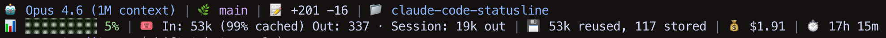
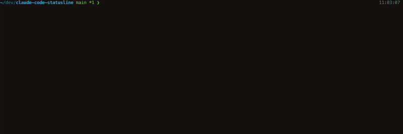

# claude-code-statusline

A customizable status line for [Claude Code](https://code.claude.com/docs/en). Shows model, context usage, tokens, cost, git status, and more — right in your terminal.



## Features

📊 **Context window** — visual progress bar with color-coded thresholds (block, solid, ASCII, gradient, or percent)

🤖 **Model info** — see which Claude model is active

🔢 **Token usage** — input/output counts, cache hit rates, session totals — four verbosity levels

💰 **Cost tracking** — running session cost in USD

🌿 **Git status** — current branch, modified/added file counts, lines changed

⏱️ **Duration** — session elapsed time

📁 **Directory** — current working directory

🎨 **8 themes** — default, catppuccin, dracula, gruvbox, nord, tokyo-night, powerline, rounded

📐 **Adaptive layout** — components flow across 1–3 lines, responsive to terminal width

🧙 **Setup wizard** — interactive configurator with live preview, back navigation, and auto-wiring to Claude Code



## Install

**Homebrew (macOS/Linux):**

```sh
brew install saarshe/tap/claude-code-statusline
```

**Go:**

```sh
go install github.com/saarshe/claude-code-statusline@latest
```

> **Note:** Make sure `$HOME/go/bin` is in your PATH. Add `export PATH="$PATH:$HOME/go/bin"` to your shell config if needed.

Or download a binary from [Releases](https://github.com/saarshe/claude-code-statusline/releases).

## Setup

Run the interactive wizard:

```sh
claude-code-statusline init
```

This lets you pick which components to show, choose a theme, and automatically wires it into Claude Code's `settings.json`.

## How it works

Claude Code supports a custom [status line](https://code.claude.com/docs/en/statusline) program. On every assistant response, it pipes a JSON blob (model, tokens, cost, context, etc.) to stdin of the configured command. This tool reads that JSON and renders a styled, multi-line status bar.

The wizard adds the following to your `~/.claude/settings.json`:

```json
{
  "statusLine": {
    "type": "command",
    "command": "claude-code-statusline"
  }
}
```

## Configuration

Config lives at `~/.claude-code-statusline/config.toml`. The wizard generates this for you, but you can edit it manually.

## License

[MIT](LICENSE)
